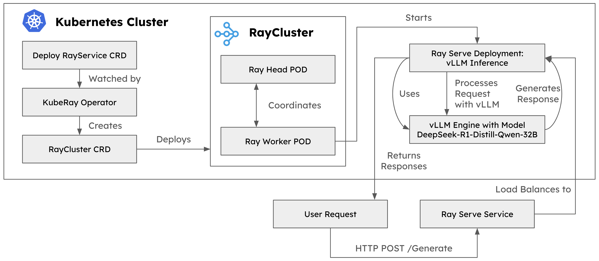

# vLLM Deployment on KubeRay

This repository provides all necessary artifacts to deploy vLLM over KubeRay, running the **DeepSeek-R1-Distill-Qwen-32B** model. The deployment is designed to be scalable, efficient, and easily manageable using Kubernetes.



## Prerequisites

Before proceeding with the deployment, ensure you have the following installed and configured:
- Kubernetes Cluster (v1.24+ recommended)
- Helm (v3+)
- kubectl
- Sufficient storage and GPU resources
- Device Plugin for GPU

## Installation Steps

### 1. Install KubeRay Operator
We deploy the KubeRay operator using Helm:
```sh
helm repo add kuberay https://ray-project.github.io/kuberay-helm/
helm repo update

# Install both CRDs and KubeRay operator v1.2.2.
helm install kuberay-operator kuberay/kuberay-operator --version 1.2.2

# Confirm that the operator is running in the namespace `default`.
kubectl get pods
# NAME                                READY   STATUS    RESTARTS   AGE
# kuberay-operator-5dd6779f94-gnghk   1/1     Running   0          27s
```

### 2. Create Persistent Volume (PV)
The PV will be used to store the **DeepSeek-R1-Distill-Qwen-32B** model.
Deploy a PersistentVolumeClaim (PVC) using the provided manifest:
```sh
kubectl apply -f manifests/persistentvolumeclaim.yaml
```

### 3. Deploy RayService
Deploy the RayService Custom Resource (CR) to run vLLM:
```sh
kubectl apply -f manifests/rayserve.yaml
```

Monitor the pod status until all are running:
```sh
kubectl get pods
```

### 4. Deploy Services
Expose the RayServe and Ray Dashboard services:
```sh
kubectl apply -f manifests/services.yaml
```

### 5. Install Open WebUI
[Open WebUI](https://github.com/open-webui/open-webui) is a powerful front-end supporting various LLM runners like Ollama and OpenAI-compatible APIs, with a built-in inference engine for RAG.

Deploy Open WebUI via Helm:
```sh
helm repo add open-webui https://helm.openwebui.com/
helm repo update
helm install webui open-webui/open-webui -f oi-values.yaml
```

After done the above steps, the PODs and services are deployed as follows.
```sh
kubectl get pods
# NAME                                                  READY   STATUS    RESTARTS   AGE
# deepseek-r1-raycluster-g79wf-gpu-group-worker-bsqcj   1/1     Running   0          153m
# deepseek-r1-raycluster-g79wf-head-htd59               1/1     Running   0          153m
# kuberay-operator-5dd6779f94-gnghk                     1/1     Running   0          37h
# open-webui-0                                          1/1     Running   0          35h
# open-webui-ollama-6974cbf5ff-bdck7                    1/1     Running   0          35h
# open-webui-pipelines-596bbc87f7-clx5l                 1/1     Running   0          35h

kubectl get svc
# NAME                                    TYPE        CLUSTER-IP       EXTERNAL-IP   PORT(S)                                         AGE
# deepseek-r1-head-svc                    ClusterIP   None             <none>        10001/TCP,8265/TCP,6379/TCP,8080/TCP,8000/TCP   147m
# deepseek-r1-raycluster-g79wf-head-svc   ClusterIP   None             <none>        10001/TCP,8265/TCP,6379/TCP,8080/TCP,8000/TCP   155m
# deepseek-r1-serve-svc                   ClusterIP   10.107.18.172    <none>        8000/TCP                                        147m
# kuberay-operator                        ClusterIP   10.110.164.74    <none>        8080/TCP                                        37h
# kubernetes                              ClusterIP   10.96.0.1        <none>        443/TCP                                         37h
# open-webui                              NodePort    10.105.12.171    <none>        80:31000/TCP                                    35h
# open-webui-ollama                       ClusterIP   10.100.152.167   <none>        11434/TCP                                       35h
# open-webui-pipelines                    ClusterIP   10.96.177.27     <none>        9099/TCP                                        35h
# ray-dashboard                           NodePort    10.106.1.7       <none>        8265:31100/TCP                                  35h
# ray-serve                               ClusterIP   10.106.35.246    <none>        8000/TCP                                        35h
```

### 6. Access the Deployment
- **RayServe API**: Exposed via `LoadBalancer` or `NodePort` (check `kubectl get svc`)
- **Ray Dashboard**: Available at `http://<Ray-Dashboard-Service-IP>:<Port>`
- **Open WebUI**: Accessible at `http://<Open-WebUI-Service-IP>:<Port>`

## Conclusion
With this setup, you have successfully deployed **vLLM over KubeRay**, running the **DeepSeek-R1-Distill-Qwen-32B** model, with a user-friendly **Open WebUI** interface for interacting with the LLM. This setup provides a scalable and efficient way to deploy AI inference workloads on Kubernetes.

For troubleshooting or further customization, refer to the documentation of [KubeRay](https://docs.ray.io/en/latest/cluster/kubernetes.html), [vLLM](https://docs.vllm.ai/en/latest/) and [Open WebUI](https://github.com/open-webui/open-webui).
